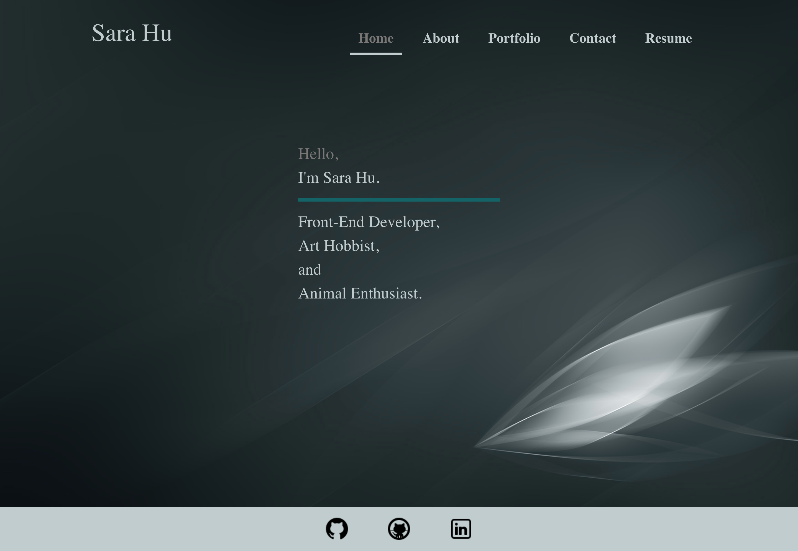

# professional-portfolio

# Website Link
[Website Link](http://shhu21.github.io/professional-portfolio)

# Preview

# Table Of Contents
* [Description](#description)
* [Built With](#built-with)
* [Installation](#installation)
* [User's Guide](#users-guide)
* [Testing](#testing)
* [Authors](#authors)
* [Developer Notes](#deveroper-notes)

# Description
A professional portfolio built using React.js with features that showcase a collection of work with their related information and links as well as contact details and resume information.

# Built With
- HTML
- CSS
- Bootstrap
- Javascript
- React.js
- Express.js

# Installation
1. Clone the repository.
2. Run `npm install` in the command line to install the dependancies.
3. Run `npm start` in the command line to start the program.

# User's Guide
As mentioned in the [Installation](#installation) instructions, run `npm start` to start the program or navigate to the [Website Link](#website-link).  From the website the user will be directed to the homepage.  The user may then peruse through the site via the navigation bar which displays home, about, portfolio, contact, and resume tabs.

## Tabs
`About`: Displays a short biography summary.  
`Portfolio`: A gallery of work where the user may click on any project to view further details such as a list of utilized technologies, a description of the project, and relevant links to the project (GitHub and/or a live website link).  
`Contact`: Contains contact information.  
`Resume`: Displays resume information as well as the option to download the Word Document and/or PDF version of the resume.  
`Footer`: The footer contains relevant links to additional information on the developer (GitHub and LinkedIn).  Please click on the icons to be redirected to the desired webpage.

# Testing
Follow the [Installation](#installation) instructions to perform manual testing.

# Authors
Sara Hu 

# Developer Notes
For further details on the development process and additional relevant notes please see the `developers-notes` directory.
